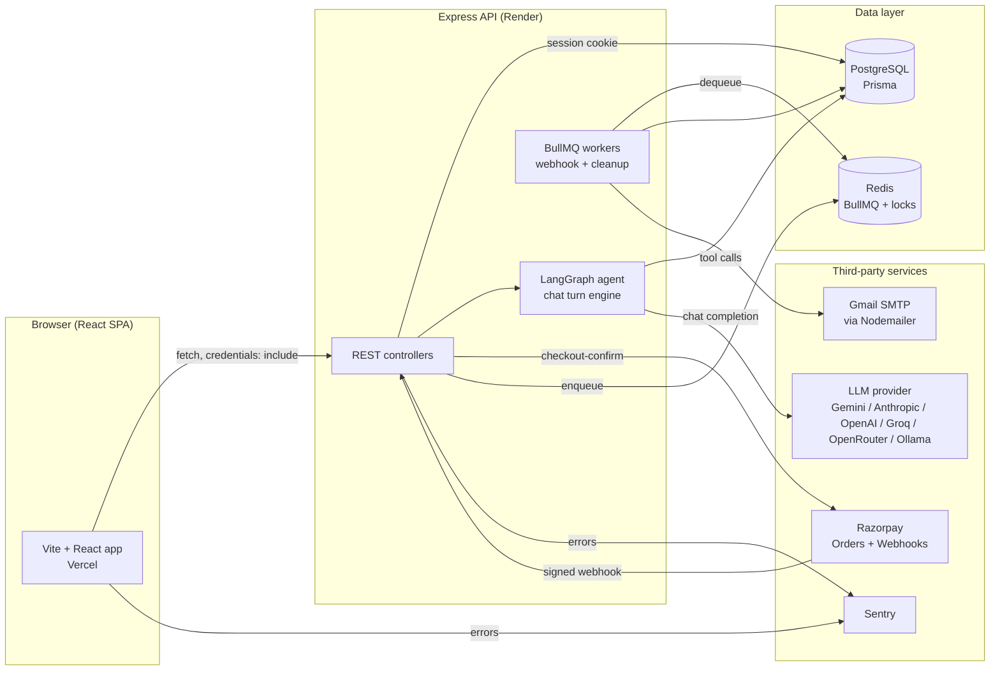
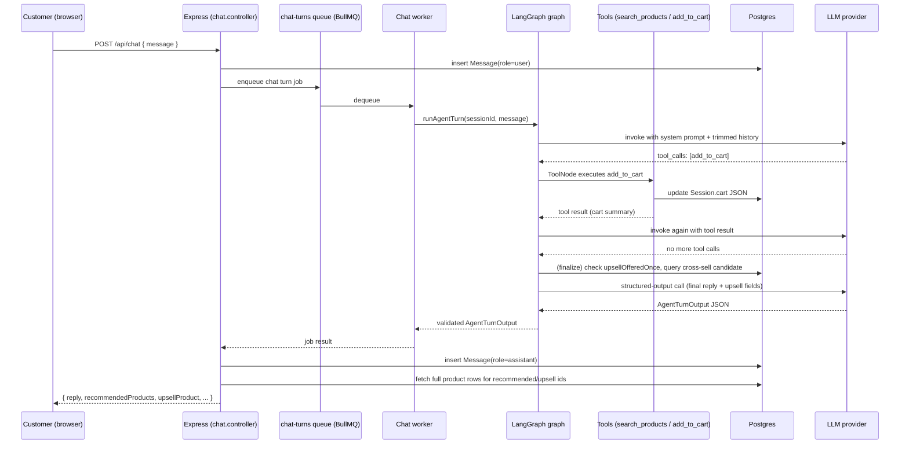

# Architecture Overview

Convocart is a conversational, AI-agent-driven shopping storefront. Instead of browsing a
category grid with filters, the customer talks to a chat assistant ("Convocart") that searches
a shoe catalog, adds items to a cart, and hands off to a classic checkout + Razorpay payment
flow. A small admin dashboard lets staff see orders and a full audit trail of what the agent did
and why.

This document is the map. Every other file in `docs/` goes deep on one slice of this diagram.

## High-level system diagram



## Repository layout

```
Convocart-main/
├── backend/                  Express + TypeScript API
│   ├── prisma/                Prisma schema, migrations, seed script
│   └── src/
│       ├── agent/              LangGraph agent: graph, tools, prompt, schema, checkpointer
│       ├── controllers/        Route handlers (thin — parse, call service, respond)
│       ├── services/           Business logic (cart, orders, upsell, products, email, stock)
│       ├── middlewares/        Session cookie, admin auth, request logging, error handler
│       ├── queue/               BullMQ queues + workers (webhook, cleanup, chat)
│       ├── schemas/             Zod input-validation schemas
│       ├── db/                  Prisma client + ioredis client singletons
│       ├── utils/                ApiError / ApiResponse / logger
│       ├── config/env.ts         Zod-validated environment config
│       ├── instrument.ts         Sentry bootstrap (imported first)
│       └── index.ts               App wiring / server bootstrap
│   └── Dockerfile
├── frontend/                 Vite + React (JS, not TS) SPA
│   └── src/
│       ├── pages/               Landing, Shop, OrderTracking, Admin*, NotFound
│       ├── components/          chat/*, cart/*, Header, AuditTrail, RequireAdminAuth, ErrorBoundary
│       └── lib/                  api.js (fetch client), razorpay.js, devLogger.js, format.js
└── .github/workflows/ci.yml   Test → Docker build → (optional) GCP deploy
```

## The three request "shapes" in this app

1. **Synchronous CRUD** — cart reads/writes, product search, checkout preview, order tracking,
   admin order list/detail. Controller → service → Prisma → JSON response. Nothing fancy.
2. **The agent turn** — `POST /api/chat`. This is the interesting one: the message is handed off
   to a BullMQ queue and processed by a dedicated chat worker running a LangGraph state machine
   (see [`03-agent-and-chat-flow.md`](./03-agent-and-chat-flow.md) and
   [`07-queues-and-background-jobs.md`](./07-queues-and-background-jobs.md)).
3. **Payment-adjacent, event-driven flow** — checkout confirmation reserves stock and creates a
   Razorpay order; Razorpay later POSTs a signed webhook that is verified synchronously and then
   **enqueued** into BullMQ for idempotent, retryable processing; a periodic cleanup worker
   self-heals anything the webhook missed. See
   [`06-payments-and-webhooks.md`](./06-payments-and-webhooks.md).

## Data model at a glance

Everything hangs off a `Session` (an anonymous, cookie-identified visitor — no user accounts
exist in this product). A session owns a `cart` (a JSON blob of `{productId, qty}` lines, *not*
a relational table), a stream of `Message` rows (chat history, persisted independently of the
LangGraph checkpoint), and any number of `Order`s. Every state-changing thing that happens to an
order — created, paid, failed, expired, reconciled — is written to `AuditLog`, which doubles as
the "why did the agent do that" explainability trail shown in the admin dashboard.
See [`02-database-schema.md`](./02-database-schema.md) for the full ERD and every field.

## Request lifecycle for a typical "add to cart" chat turn



## Where things actually run

| Piece | Where |
|---|---|
| Frontend (React SPA, static build) | Vercel — `https://convocart-oqc5.vercel.app/` |
| Backend (Express API + BullMQ workers, single process) | Render — `https://convocart-backend.onrender.com` (`/health`) |
| PostgreSQL | Managed Postgres (Render/Neon/etc. — connection via `DATABASE_URL`) |
| Redis | Managed Redis (Render/Upstash/etc. — connection via `REDIS_URL`) |
| CI | GitHub Actions (`.github/workflows/ci.yml`) — tests + Docker image push to GHCR |

The GitHub Actions workflow also contains an optional `deploy` job for pushing the built Docker
image out to a self-hosted GCP VM, available as an alternative deployment target alongside the
Render/Vercel setup described above. See
[`13-ci-cd-and-deployment.md`](./13-ci-cd-and-deployment.md) for the full CI/CD pipeline.

## Continue reading

- [`02-database-schema.md`](./02-database-schema.md) — every table, every field, the ERD
- [`03-agent-and-chat-flow.md`](./03-agent-and-chat-flow.md) — the LangGraph state machine, tools, system prompt, guardrails
- [`04-upsell-logic.md`](./04-upsell-logic.md) — how the one-shot upsell recommendation is chosen
- [`05-cart-and-checkout.md`](./05-cart-and-checkout.md) — cart model, stock reservation, checkout flow
- [`06-payments-and-webhooks.md`](./06-payments-and-webhooks.md) — Razorpay, webhook idempotency, self-healing reconciliation
- [`07-queues-and-background-jobs.md`](./07-queues-and-background-jobs.md) — BullMQ queues/workers
- [`08-admin-dashboard-and-auth.md`](./08-admin-dashboard-and-auth.md)
- [`09-security.md`](./09-security.md)
- [`10-logging-observability-and-error-handling.md`](./10-logging-observability-and-error-handling.md)
- [`11-frontend-architecture.md`](./11-frontend-architecture.md)
- [`12-environment-variables.md`](./12-environment-variables.md)
- [`13-ci-cd-and-deployment.md`](./13-ci-cd-and-deployment.md)
- [`14-testing.md`](./14-testing.md)
- [`15-known-issues-and-bugs.md`](./15-known-issues-and-bugs.md) — status of known issues and fixes
- [`16-improvement-ideas.md`](./16-improvement-ideas.md) — feature & improvement roadmap
