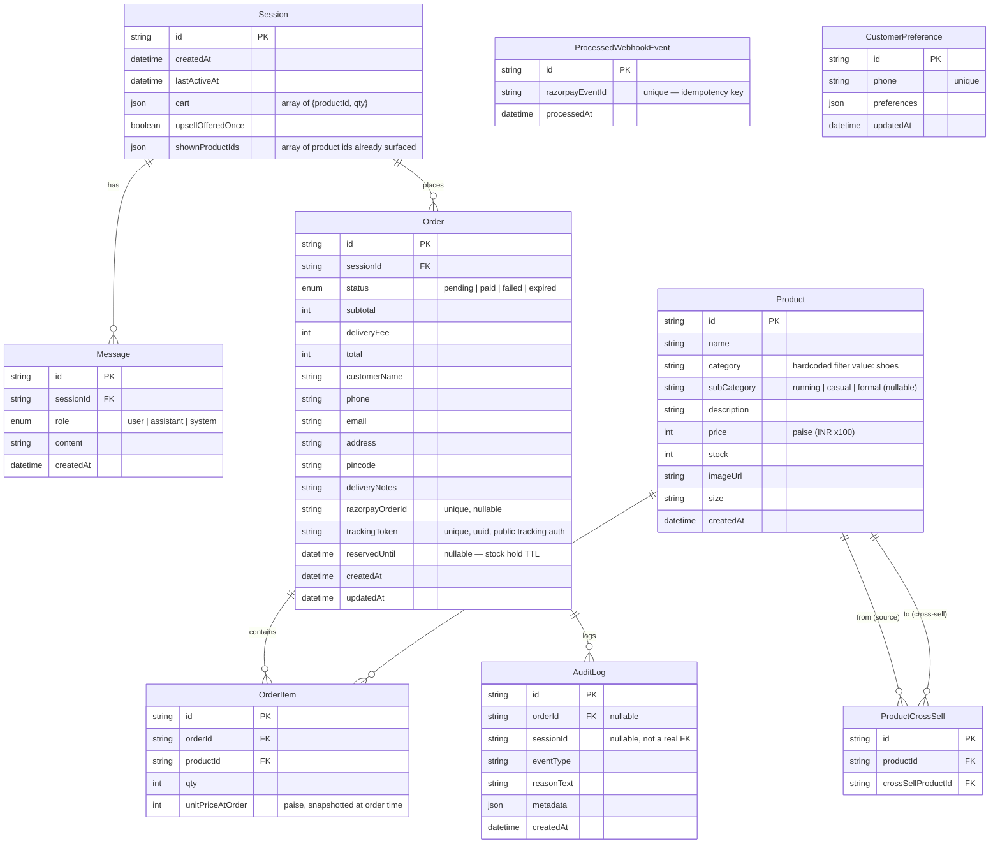

# Database Schema

Source of truth: `backend/prisma/schema.prisma`. Provider: PostgreSQL. ORM: Prisma 6.

## Entity-relationship diagram

## Table-by-table notes

### `Session`
The anonymous visitor identity. Created lazily by `sessionMiddleware` on first request and
stored as an httpOnly cookie (`convocart_session`, 30-day expiry). There is **no user account
system** — a session *is* the identity, for both chat and cart.

- `cart` is a denormalized JSON array (`{productId, qty}[]`), not a relational `CartItem` table.
  See [`05-cart-and-checkout.md`](./05-cart-and-checkout.md) for why and the trade-offs.
- `upsellOfferedOnce` enforces the "at most one upsell per session, ever" business rule — flipped
  to `true` the first time the agent successfully offers a cross-sell item, and checked before
  any future offer is even computed.
- `shownProductIds` accumulates every product id the `search_products` tool has ever returned to
  this session, so later searches can exclude already-seen items (used to detect "you've shown me
  this already" and to naturally rotate variety).

### `Message`
Plain chat transcript, written directly by `chat.controller.ts` (one row for the user's message,
one for the assistant's final reply) — independent of LangGraph's own checkpoint state (see
[`03-agent-and-chat-flow.md`](./03-agent-and-chat-flow.md#two-separate-notions-of-chat-history)).
Used to render the transcript in the admin order-detail page.

### `Product`
Catalog search (`products.services.ts`) is scoped to `category: 'shoes'`, with `subCategory`
(`running` / `casual` / `formal`) and `size` as the customer-facing filters. Products with
`category: 'accessories'` (socks, insoles, shoe care items — see the seed data) are surfaced
exclusively through the upsell/cross-sell mechanism rather than direct search, keeping the main
shopping flow focused on shoes while accessories appear as natural add-ons. `price` and all money
fields throughout the schema are **integers in paise** (₹1 = 100) to avoid floating-point
rounding on currency.

### `ProductCrossSell`
A directed edge table: "if the cart contains `productId`, `crossSellProductId` is an eligible
upsell candidate." Seeded manually (e.g. running shoes → running socks). Consumed by
`upsell.services.ts`. See [`04-upsell-logic.md`](./04-upsell-logic.md).

### `Order`
- `status` moves `pending → paid` or `pending → failed` or `pending → expired`. There is no
  refund/cancel/return status — those flows don't exist in this build.
- `reservedUntil` is the stock-hold expiry (order creation time + 15 minutes,
  `RESERVATION_MINUTES` in `order.services.ts`). The cleanup worker sweeps every 2 minutes for
  `pending` orders past this timestamp.
- `razorpayOrderId` is set right after the order row is created, once the Razorpay order has
  been created via their API.
- `trackingToken` is a random UUID, independent of the primary key, used to authorize the public
  `/track/:orderId?token=...` page without requiring a login — compared with
  `crypto.timingSafeEqual` to avoid timing attacks (see [`09-security.md`](./09-security.md)).

### `OrderItem`
`unitPriceAtOrder` is a **price snapshot** — deliberately never re-reads the live `Product.price`
after checkout, so a later price change never retroactively alters a past order's total.

### `AuditLog`
The explainability/audit trail. Every meaningful state transition writes a human-readable
`reasonText` here, not just a status code — this is what powers the timeline in
`AuditTrail.jsx` on both the admin order-detail page and the public order-tracking page. Event
types actually emitted anywhere in the backend:

| `eventType` | Emitted by | Meaning |
|---|---|---|
| `order_created` | `order.services.ts` | Checkout confirmed, stock reserved, Razorpay order pending |
| `upsell_offered` | `agent/graph.ts` (`finalizeNode`) | Agent surfaced a cross-sell item this turn |
| `payment_captured` | `webhook.worker.ts` | Razorpay webhook confirmed payment |
| `payment_failed` | `webhook.worker.ts` | Razorpay webhook reported a declined/failed payment |
| `payment_reconciled_late` | `cleanup.worker.ts` | Webhook was missed; reconciliation against Razorpay's API found the payment was real |
| `order_expired` | `cleanup.worker.ts` | Reservation TTL passed and reconciliation confirmed no payment; stock released |

The frontend's `AuditTrail.jsx` component also defines display metadata for a couple of
additional event types (e.g. `payment_initiated`, `upsell_candidate_skipped`) used for UI
prototyping/demo purposes — the table above lists the event types the backend itself writes.

### `ProcessedWebhookEvent`
Pure idempotency ledger for Razorpay webhooks — one row per processed `(event type, payment id)`
pair, checked before any side effect runs. See
[`06-payments-and-webhooks.md`](./06-payments-and-webhooks.md).

### `CustomerPreference`
A `phone`-keyed table with a freeform `preferences` JSON column, laid out for
personalization — e.g. remembering a returning customer's usual size or preferred style so the
agent can tailor results without asking again. See
[`16-improvement-ideas.md`](./16-improvement-ideas.md) for how this ties into the personalization
roadmap.

## Migrations & seeding

- Migrations live under `backend/prisma/migrations/` and are applied with
  `npx prisma migrate dev` (local) or `npx prisma migrate deploy` (the Dockerfile's `CMD` runs
  this automatically on container start).
- `backend/prisma/seed.ts` is the **only** code path in the entire repo that inserts `Product` /
  `ProductCrossSell` rows — there is no admin "add product" UI or API. The file ships with its
  entire body commented out (`// uncomment this script to run and get products in your db`), so
  running `npx prisma db seed` fresh from the repo is a no-op. You must open the file and
  uncomment it before seeding. See the root [`README.md`](../README.md#seeding-product-data) for
  the exact steps.

## LangGraph checkpoint tables

Not modeled in `schema.prisma` — `@langchain/langgraph-checkpoint-postgres`'s `PostgresSaver`
creates and manages its own tables (`checkpoints`, `checkpoint_writes`, etc.) directly against
`DATABASE_URL` the first time `ensureCheckpointerSetup()` runs (called once at server boot in
`index.ts`). These store the LangGraph message-state per `thread_id` (== `sessionId`), separate
from the human-readable `Message` table above. See
[`03-agent-and-chat-flow.md`](./03-agent-and-chat-flow.md).
