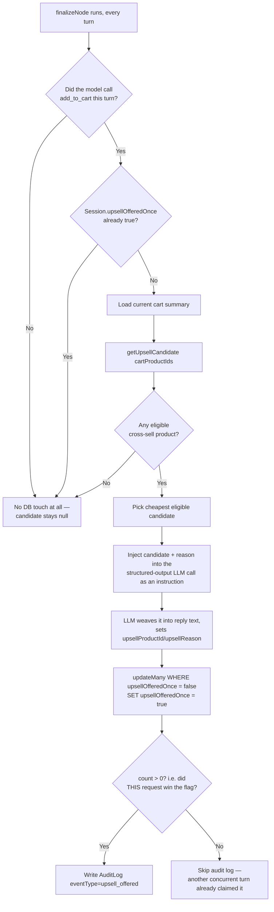

# Upsell Logic

Convocart's one distinguishing "smart" feature beyond search is a single, disciplined upsell
suggestion per session — never a wall of "customers also bought." This document covers exactly
how a candidate is chosen, when it's allowed to fire, and how it's presented.

## The rule, in one sentence

**At most one upsell offer, ever, per session — computed server-side from real cross-sell data,
only after a genuine cart-add, and only woven into the reply text by the LLM, never chosen by
it.**

## Where it lives

- Candidate selection: `backend/src/services/upsell.services.ts` (`getUpsellCandidate`)
- Trigger + gating + persistence: `backend/src/agent/graph.ts` (`finalizeNode`)
- Data source: the `ProductCrossSell` table (see
  [`02-database-schema.md`](./02-database-schema.md))

## Flow



## `getUpsellCandidate(cartProductIds)`

```ts
export async function getUpsellCandidate(cartProductIds: string[]) {
  if (cartProductIds.length === 0) return null;

  const candidates = await prisma.productCrossSell.findMany({
    where: { productId: { in: cartProductIds } },
    include: { crossSellProduct: true },
  });

  const eligible = candidates
    .map((c) => c.crossSellProduct)
    .filter((p) => p.stock > 0 && !cartProductIds.includes(p.id))
    .filter((p, index, arr) => arr.findIndex((x) => x.id === p.id) === index); // dedupe

  if (eligible.length === 0) return null;

  const sorted = [...eligible].sort((a, b) => a.price - b.price);
  const chosen = sorted[0]!;

  const reasonTemplate = REASON_TEMPLATES[chosen.subCategory ?? ''] ?? (default template);

  return { productId: chosen.id, name: chosen.name, price: chosen.price / 100, reason: reasonTemplate(chosen.name) };
}
```

Step by step:

1. **Look up every `ProductCrossSell` edge** whose source `productId` is currently in the cart —
   this can pull in candidates from *multiple* cart lines at once (e.g. both a running shoe and a
   casual shoe in the same cart each contribute their own cross-sell edges).
2. **Filter to eligible candidates**: must have `stock > 0`, must not already be in the cart
   itself, deduped by id (in case two different cart items cross-sell to the same accessory).
3. **If nothing is eligible, no upsell happens this turn** — silently, no error, no log.
4. **Pick the single cheapest eligible candidate.** This is a deliberate, simple heuristic — not
   "most relevant," not weighted by margin — lowest price wins. (See
   [`16-improvement-ideas.md`](./16-improvement-ideas.md) for smarter alternatives.)
5. **Build a canned reason string** keyed off the *chosen accessory's* `subCategory`
   (`running`/`casual`/`formal`) via `REASON_TEMPLATES`, e.g. `"Running shoe customers often add
   {name} for extra comfort on long runs."` Falls back to a generic template if the subcategory
   doesn't match a template key.

## Gating in `finalizeNode`

Two gates must both pass before `getUpsellCandidate` is even called:

1. **`wasAddToCartCalledThisTurn(messages)`** — scans backward from the *most recent human
   message* for a `tool` message named `add_to_cart`. If the customer didn't actually add
   something to their cart this turn (browsing, asking questions, chit-chat), the function
   returns immediately with `candidate = null` and **makes zero database queries** — an explicit
   perf/cost optimization noted in a code comment.
2. **`Session.upsellOfferedOnce === false`** — if this session has ever successfully been offered
   an upsell before, skip the lookup entirely.

Only if both gates pass does the code fetch the live cart summary and call
`getUpsellCandidate`.

## How the LLM is told about it — and why it can't invent one

The candidate (if any) is turned into a plain-English **instruction string** and appended as a
user-role message right before the final structured-output call:

```
You must mention this upsell naturally as part of your reply: {name} (₹{price}).
Use this reasoning, lightly rephrased to fit your sentence: "{reason}"
```

The system prompt separately tells the model it "may suggest at most ONE additional item per
checkout, and only from the candidate list explicitly provided to you for that purchase — never
suggest anything outside that list." Combined, this means: **the model never decides whether or
what to upsell** — that's 100% deterministic server-side logic. The model's only job is to phrase
the already-chosen suggestion naturally in its reply, and to copy the `productId`/`reason` into
the structured output fields (which the code then overwrites explicitly anyway —
`structured.upsellProductId = candidate.productId` — so even a model mistake here can't leak a
wrong id to the customer).

## Marking the flag — race-safety

```ts
const marked = await prisma.session.updateMany({
  where: { id: state.sessionId, upsellOfferedOnce: false },
  data: { upsellOfferedOnce: true },
});
if (marked.count > 0) {
  await prisma.auditLog.create({ data: { ..., eventType: 'upsell_offered', ... } });
}
```

Using a conditional `updateMany` (rather than a naive read-then-write) means that if two
concurrent chat turns for the same session somehow both computed a candidate, only the request
that actually flips the flag from `false → true` writes the audit log entry — keeping the audit
trail clean with exactly one canonical "offer" event per session, even under concurrency.

## Where the customer actually sees it

The API response's `upsellProduct` (a full `Product` row, resolved server-side from
`upsellProductId`) and `upsellReason` fields are rendered by `UpsellCard.jsx` in the chat panel —
a distinct visual treatment from the regular `recommendedProducts` / `ProductCard.jsx` results,
with its own "Add" button that calls `api.addToCart` directly (bypassing the agent entirely for
that one click).
