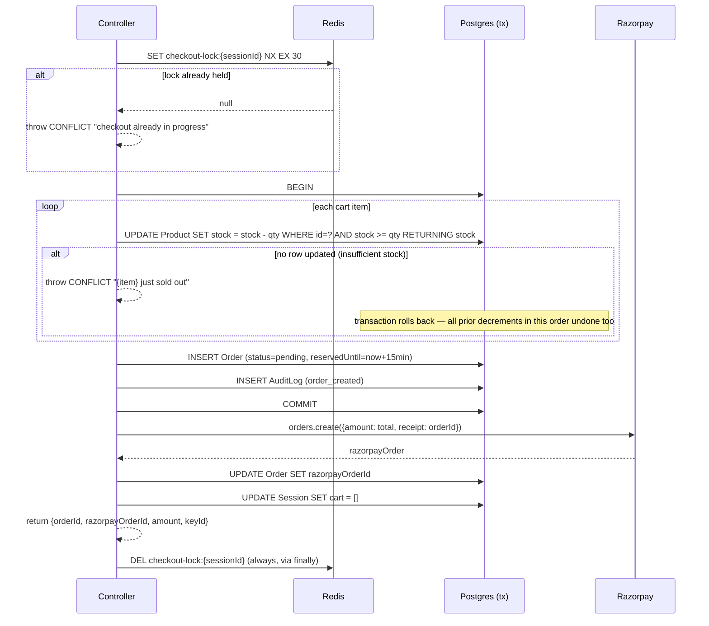

# Cart & Checkout

## The cart is not a table

`Session.cart` is a single JSON column: `{ productId: string, qty: number }[]`. There is no
`CartItem` relational table. Every cart mutation is a full read-modify-write of that JSON array
against the `Session` row (`backend/src/services/cart.services.ts`):

```ts
async function getCart(sessionId) { return (session?.cart) ?? []; }
async function saveCart(sessionId, cart) { await prisma.session.update({ where: {id: sessionId}, data: { cart } }); }
```

This keeps the cart model simple for the "one shopper, one cart" shape of this app:
- Every mutation is a full read of the current array, an in-memory update, and a single write
  back — no separate cart-line rows to keep in sync.
- Cart contents in the JSON blob are just `{productId, qty}` — **prices are never stored in the
  cart itself**, only resolved live at read time (`getCartSummary`) by re-joining against the
  current `Product.price`. This means a price change immediately affects everyone's cart total
  the next time it's viewed, right up until checkout locks in a snapshot (see below).

## `addToCart` is additive, not absolute

```ts
export async function addToCart(sessionId, productId, qty) {
  const cart = await getCart(sessionId);
  const existing = cart.find((c) => c.productId === productId);
  const newQty = Math.min((existing?.qty ?? 0) + qty, 5);
  if (existing) existing.qty = newQty;
  else cart.push({ productId, qty: newQty });
  await saveCart(sessionId, cart);
  return getCartSummary(sessionId);
}
```

`qty` is a **delta to add**, capped at 5 total per line — it is *not* "set the quantity to X."
The frontend's quantity stepper (`CartDrawer` → `CartLineItem` → `ShopPage.handleQtyChange`)
works around this deliberately: to set an absolute target quantity it calls
`removeFromCart(productId)` followed by `addToCart(productId, targetQty)` — a documented
workaround (there's a comment explaining exactly this in `ShopPage.jsx`). It does mean a quantity
nudge is two round trips instead of one, with a brief moment where the line is absent from the
cart between the two calls.

The LLM-facing `add_to_cart` tool goes through this same additive function — which is why the
system prompt is so insistent that quantity must never be "carried" from a previous request in
the same conversation (otherwise "add another pair" semantics would double-add unpredictably).

## Cart summary & pricing

```ts
const DELIVERY_FEE = 3000; // ₹30, flat, hardcoded

export async function getCartSummary(sessionId) {
  const cart = await getCart(sessionId);
  if (cart.length === 0) return { items: [], subtotal: 0, deliveryFee: 0, total: 0 };
  const products = await prisma.product.findMany({ where: { id: { in: cart.map(c => c.productId) } } });
  const items = cart.map(line => {
    const product = products.find(p => p.id === line.productId)!;
    return { productId, name, unitPrice: product.price, qty: line.qty, lineTotal: product.price * line.qty };
  });
  const subtotal = items.reduce((sum, i) => sum + i.lineTotal, 0);
  return { items, subtotal, deliveryFee: DELIVERY_FEE, total: subtotal + DELIVERY_FEE };
}
```

Delivery is a flat ₹30 whenever the cart is non-empty, ₹0 when it's empty — a simple, predictable
shipping cost rather than a zone- or weight-based calculation.

## Checkout: preview vs confirm

Two distinct endpoints, deliberately separated:

- **`POST /api/cart/checkout-preview`** — validates the delivery-details form (`DeliveryDetails`
  Zod schema: name, phone, email, address, pincode, optional notes) and returns the current cart
  summary alongside the validated delivery data. **Writes nothing.** This is what the frontend's
  `CheckoutFlow.jsx` uses to render the review screen before the customer commits.
- **`POST /api/cart/checkout-confirm`** — the real thing: reserves stock, creates the `Order`
  row, creates the Razorpay order, and clears the cart.

## `confirmOrder` — the checkout transaction



### Why the Redis lock

A short-lived (`EX 30`, `NX`) Redis key per session prevents a customer double-tapping "Place
order" (or a retried request) from racing two checkouts for the same session simultaneously. The
30-second TTL is explicitly a dead-process safety net (comment in the code) — the normal path
always deletes the key itself in a `finally` block regardless of success or failure.

### Atomic, race-safe stock reservation

Stock is decremented with a single conditional `UPDATE ... WHERE stock >= qty RETURNING stock`
raw SQL statement per item, inside a Prisma interactive transaction — this is the correct way to
prevent overselling under concurrency (two different customers checking out the last pair of
shoes at the same time): whichever request's `UPDATE` finds enough stock wins atomically at the
database level; the loser gets `result.length === 0` and the **entire transaction rolls back**,
including any earlier successful decrements for *other* items in that same order. So a
multi-item checkout is genuinely all-or-nothing.

### Sequencing of the transaction and the Razorpay call

The stock-reservation transaction commits, and *only then* does the code call
`razorpay.orders.create(...)` — a separate network call, made after the transaction rather than
inside it (Razorpay isn't transactional with Postgres, so it couldn't be anyway). Once that call
succeeds, `razorpayOrderId` is attached to the order and the cart is cleared. Any order that
never picks up a payment — whether because the customer abandoned checkout or anything else kept
it from being paid — is caught by the cleanup worker's reservation-TTL sweep described in
[`06-payments-and-webhooks.md`](./06-payments-and-webhooks.md), which releases the held stock
after the reservation window passes.

## After checkout: what the frontend does

`CheckoutFlow.jsx` receives `{orderId, razorpayOrderId, amount, currency, keyId}` from
`checkout-confirm` and immediately opens Razorpay's client-side Checkout widget
(`frontend/src/lib/razorpay.js`) using that `keyId`/`razorpayOrderId`/`amount`. Razorpay handles
the actual payment UI (cards/UPI/etc.) entirely client-side; Convocart's backend only finds out
the outcome later, via webhook (or, if the webhook is missed, via the reconciliation sweep) — see
[`06-payments-and-webhooks.md`](./06-payments-and-webhooks.md). The frontend does **not** poll
for payment status after opening the widget beyond Razorpay's own success/dismiss callbacks; the
durable source of truth for "did this order get paid" is always the backend's `Order.status`,
surfaced to the customer via the `/track/:orderId` page.
