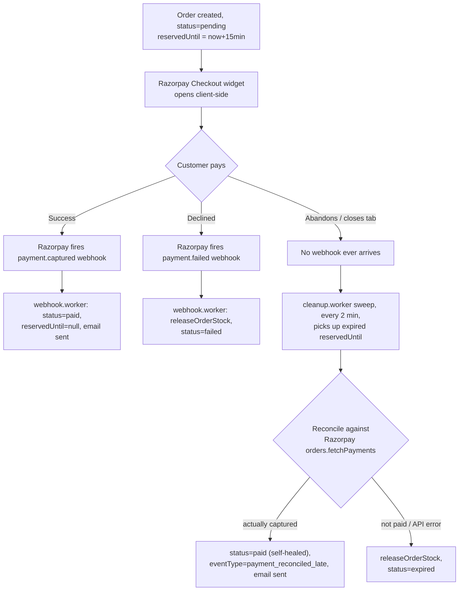

# Payments & Webhooks (Razorpay)

Convocart uses [Razorpay](https://razorpay.com/) for payment collection, with a webhook +
periodic-reconciliation design built to be resilient to missed/delayed webhook delivery — a
real-world necessity, since webhook delivery is never 100% guaranteed.

## The three ways an order's payment status gets settled



Three independent settlement paths converge on the same two possible correct end states
(`paid` or `failed`/`expired`), and the design assumes **webhooks can be missed** — the periodic
sweep is not just a TTL cleanup, it's a genuine reconciliation safety net that can flip an order
to `paid` even if the webhook never arrived.

## 1. Webhook receipt — `webhook.controller.ts`

```
POST /api/webhooks/razorpay
```

- Mounted with `express.raw({ type: 'application/json' })` **specifically for this one route**
  (see the two-branch body-parser wiring in `index.ts`) — the raw request bytes are required to
  verify the HMAC signature; JSON-parsing first would change the byte-for-byte body and break
  verification.
- Also explicitly **excluded from the global rate limiter** (`if (req.path.startsWith('/api/webhooks')) return next();`)
  — Razorpay's own delivery/retry cadence shouldn't be throttled by an IP-based limiter.
- Signature check: `HMAC-SHA256(RAZORPAY_WEBHOOK_SECRET, rawBody)` compared to the
  `x-razorpay-signature` header using `crypto.timingSafeEqual` (constant-time, avoids timing
  side-channels) — a length check happens first since `timingSafeEqual` requires equal-length
  buffers.
- On success, the **parsed event body is pushed onto a BullMQ queue** (`webhookQueue.add(...)`)
  and the handler immediately returns `200 { received: true }`. **Actual processing happens
  asynchronously in the worker, not in this handler.** This is the correct pattern (contrast with
  the chat flow — see [`07-queues-and-background-jobs.md`](./07-queues-and-background-jobs.md))
  — Razorpay expects a fast 2xx response and will retry on timeout/non-2xx, so keeping this
  handler to "verify + enqueue" avoids webhook retry storms if downstream processing is briefly
  slow.

## 2. Webhook processing — `webhook.worker.ts`

Runs on the `webhook-events` BullMQ queue.

### Idempotency

```ts
const eventId = event.event + ':' + (event.payload?.payment?.entity?.id ?? job.id);
const already = await prisma.processedWebhookEvent.findUnique({ where: { razorpayEventId: eventId } });
if (already) { /* skip */ return; }
```

Razorpay (like most webhook providers) can and will redeliver the same event more than once. The
worker derives a composite idempotency key from the event type + the Razorpay payment entity id
(falling back to the BullMQ job id if that's somehow absent), checks `ProcessedWebhookEvent`
before doing anything, and only **writes** that idempotency record as the very last step, after
all side effects (DB update, email) have completed. If the worker crashes mid-processing,
BullMQ's own retry will re-run the job, and since the idempotency row wasn't written yet, it
simply redoes the work — safe here because the two effects (`payment.captured` → mark paid +
email; `payment.failed` → release stock + mark failed) are themselves each wrapped in a single
Prisma `$transaction`. The `payment.failed` path and the cleanup worker's expiry path both only
release stock for orders still in `pending` status, and each transitions the order's status in
the same transaction as the release — keeping the two release paths cleanly separated.

### `payment.captured`

1. Look up the `Order` by `razorpayOrderId` (extracted from
   `event.payload.payment.entity.order_id`). If not found, log a warning and stop (nothing to do
   — e.g. a webhook for an order this system never created).
2. Transaction: `Order.status = 'paid'`, `reservedUntil = null`; insert an `AuditLog` row
   (`eventType: 'payment_captured'`).
3. Send the order-confirmation email (`sendOrderConfirmation`, see below) — **outside** the DB
   transaction, after it commits.
4. Write the `ProcessedWebhookEvent` idempotency record.

### `payment.failed`

1. Same order lookup.
2. `releaseOrderStock(order.id)` — adds every line item's `qty` back onto `Product.stock` via a
   transaction of raw `UPDATE ... SET stock = stock + qty` statements.
3. Transaction: `Order.status = 'failed'`, `reservedUntil = null`; `AuditLog`
   (`eventType: 'payment_failed'`).

## 3. Cleanup / reconciliation worker — `cleanup.worker.ts`

A **scheduled** BullMQ job (`cleanupQueue.upsertJobScheduler('stock-cleanup-sweep', { every: 2 *
60 * 1000 }, ...)`, registered once at server boot via `scheduleCleanupJob()`) runs every 2
minutes and finds every `Order` where `status = 'pending' AND reservedUntil < now()`.

For each expired order:

1. **If it has a `razorpayOrderId`**, call `reconcileWithRazorpay(razorpayOrderId)` — hits
   Razorpay's `orders.fetchPayments` API directly and checks if any associated payment has
   `status === 'captured'`. If the Razorpay API call itself errors, this is treated
   conservatively as `'not_paid'` (logged for manual review, not silently assumed paid).
2. **If Razorpay confirms it was actually paid** (webhook was missed, but the money is real):
   mark it `paid` (**not** `expired`), keep the reserved stock as a real sale, write
   `AuditLog(eventType: 'payment_reconciled_late')`, and send the confirmation email — exactly
   the same customer-facing outcome as if the webhook had arrived on time. This is the
   self-healing behavior that makes the whole system tolerant of webhook delivery failures.
3. **If Razorpay confirms it was not paid** (or it never even reached Razorpay —
   `razorpayOrderId` is null, meaning the customer abandoned checkout before the order-creation
   call to Razorpay ever completed): `releaseOrderStock`, mark `expired`, write
   `AuditLog(eventType: 'order_expired')`.

This means the **15-minute reservation window plus the 2-minute sweep cadence** is the real
answer to "how long does an abandoned checkout hold stock hostage" — worst case around 17
minutes from order creation to a fully released, re-purchasable item.

## Order-confirmation email

`services/email.services.ts` uses **Nodemailer with Gmail** (`GMAIL_USER_NAME` +
`GMAIL_APP_PASSWORD`, an [app password](https://support.google.com/accounts/answer/185833), not
the account's real password) to send the order-confirmation email. It's a single inline-styled
HTML table (order items, subtotal, delivery fee, total, a "Track your order" button linking to
`${FRONTEND_URL}/track/{orderId}?token={trackingToken}`). Send failures are caught and logged,
never thrown — a failed email never fails the webhook job or blocks an order from being marked
paid.

## What the customer/admin actually sees

- **Customer**: the public `/track/:orderId?token=...` page (token-gated, timing-safe compared
  against `Order.trackingToken`) shows current status plus the full `AuditLog` timeline in plain
  language via `AuditTrail.jsx`.
- **Admin**: the same audit trail, plus the full order detail and chat transcript, on
  `/admin/orders/:orderId` — see
  [`08-admin-dashboard-and-auth.md`](./08-admin-dashboard-and-auth.md).
