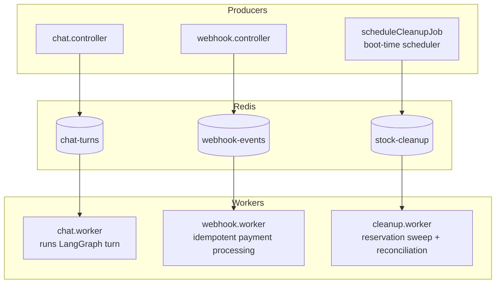

# Queues & Background Jobs (BullMQ)

Convocart uses [BullMQ](https://docs.bullmq.io/) on top of Redis for background processing.
There are three queue/worker pairs defined in `backend/src/queue/`, all active in the running
application.

| Queue name | File(s) | Producer | Consumer |
|---|---|---|---|
| `chat-turns` | `chat.queue.ts`, `chat.worker.ts` | `chat.controller.ts` | `chat.worker.ts` |
| `webhook-events` | `webhook.queue.ts`, `webhook.worker.ts` | `webhook.controller.ts` | `webhook.worker.ts` |
| `stock-cleanup` | `cleanup.worker.ts` (defines both queue and worker) | `scheduleCleanupJob()`, called at boot | `cleanup.worker.ts` |

## `chat-turns`

Producer: `chat.controller.ts` enqueues each incoming customer message (`sessionId`, `message`)
onto `chatQueue` as soon as it's validated and the user's `Message` row is persisted.

Consumer: `chat.worker.ts` dequeues the job and calls `runAgentTurn(sessionId, message)` — the
full LangGraph state machine described in
[`03-agent-and-chat-flow.md`](./03-agent-and-chat-flow.md), including its own internal timeout
and retry handling per LLM call. Running the turn inside a worker job (rather than inline in the
HTTP handler) means a slow or retried LLM call occupies a background job slot instead of holding
open the customer's HTTP connection, and BullMQ's own job-level retry/backoff is available as an
extra layer of resilience around the whole turn.

`chat.queue.ts` also exports `chatQueueEvents` (a `QueueEvents` instance), used to await a given
job's completion so the HTTP response can be returned once the turn finishes.

## `webhook-events`

Producer: `razorpayWebhookHandler` enqueues the verified Razorpay event payload as a job named
`'process-event'` immediately after signature verification, then returns `200` to Razorpay.

Consumer: `webhookWorker` — idempotent processing of `payment.captured` / `payment.failed`
events, protected by the `ProcessedWebhookEvent` table. Full detail in
[`06-payments-and-webhooks.md`](./06-payments-and-webhooks.md). BullMQ's own retry-on-throw
behavior (default backoff) covers transient failures (e.g. a momentary DB blip); a
`worker.on('failed', ...)` handler logs anything that exhausts retries for manual follow-up.

## `stock-cleanup`

Not triggered by any user action — it's a **self-scheduled recurring job**. At server boot,
`index.ts` calls `scheduleCleanupJob()`, which uses BullMQ's `upsertJobScheduler` to register a
repeating job (`every: 2 * 60 * 1000` — every 2 minutes) named `'stock-cleanup-sweep'`. Because
it's an *upsert*, restarting the server doesn't create duplicate schedules.

The worker function takes no per-job input — each run does a fresh `SELECT` for every `pending`
order whose `reservedUntil` has passed, and reconciles each one against Razorpay before deciding
to mark it `paid` (self-heal) or `expired` (release stock). Full detail in
[`06-payments-and-webhooks.md`](./06-payments-and-webhooks.md).

## Redis's other job in this app

Redis isn't only a BullMQ broker — it's also used directly for the checkout mutual-exclusion
lock (`redis.set(lockKey, '1', 'EX', 30, 'NX')` in `order.services.ts`, see
[`05-cart-and-checkout.md`](./05-cart-and-checkout.md)). The same `ioredis` client instance
(`backend/src/db/redis.ts`) is shared across all of these purposes.

## Local development note

Running the backend locally with `npm run dev` starts all three queue workers as part of the
same single Node process — there's no separate "worker" process/command in this codebase.
`REDIS_URL` must point at a real, reachable Redis instance for the server to boot at all (env
validation requires it unconditionally). See the root [`README.md`](../README.md) for the
fastest way to get a local Redis running.
