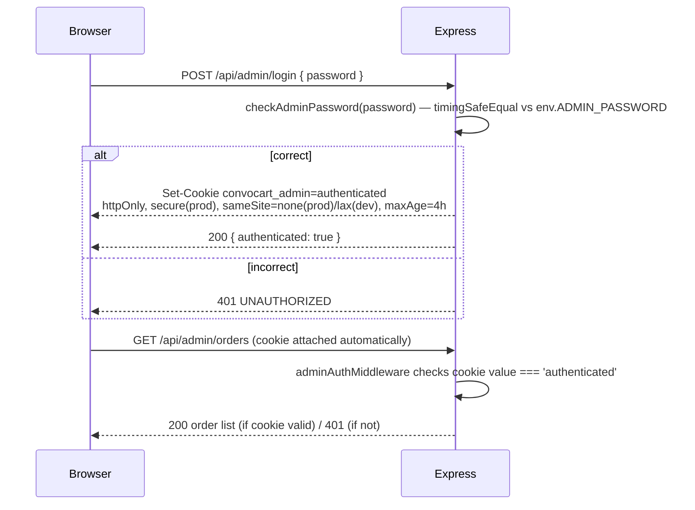

# Admin Dashboard & Auth

Convocart has a minimal, read-only admin surface: no product management, no order actions
(refund/cancel/resend-email), no user/staff accounts — just **login with a single shared
password**, **view every order**, and **view one order's full detail**, including the audit
trail and chat transcript that produced it.

## Auth model

There are **no user accounts anywhere in this app** — not for customers (they're identified by
an anonymous `Session` cookie) and not for admins. Admin access is a single, shared password
stored as one environment variable (`ADMIN_PASSWORD`).

- `checkAdminPassword` compares the submitted password to `env.ADMIN_PASSWORD` with
  `crypto.timingSafeEqual` (after a cheap length check, since `timingSafeEqual` requires
  equal-length buffers) — protects against timing side-channel attacks on the password compare,
  even though the password itself is just a flat string.
- The session cookie's *value* is the literal string `"authenticated"` — not a signed token, not
  a JWT, not tied to a server-side session record. It's `httpOnly` (so client-side JS can't read
  or forge it) and `secure` in production, which is the actual protection here — anyone without
  access to the cookie can't set it themselves. There's no way to invalidate a specific admin
  session early (e.g. "log out everywhere") short of rotating `ADMIN_PASSWORD`, and no explicit
  logout endpoint exists in the backend (the frontend does not appear to clear the cookie via a
  logout call either — there's no `/api/admin/logout` route).
- Cookie lifetime is 4 hours (`maxAge: 4 * 60 * 60 * 1000`), independent of activity — not a
  sliding/refreshed session.
- `POST /api/admin/login` sits behind the same global IP rate limiter as every other route (30
  requests/minute per IP, since only `/api/webhooks/*` is exempted) — a modest brute-force
  deterrent, but 1,800 attempts/hour per IP is still generous against a weak password. See
  [`09-security.md`](./09-security.md) for the full picture.

## Routes

| Method | Path | Auth | Handler |
|---|---|---|---|
| `POST` | `/api/admin/login` | none (this *is* the login) | `adminLoginHandler` |
| `GET` | `/api/admin/orders` | `adminAuthMiddleware` | `listOrdersHandler` |
| `GET` | `/api/admin/orders/:orderId` | `adminAuthMiddleware` | `getOrderDetailHandler` |

`adminAuthMiddleware` is a simple gate: if `req.cookies.convocart_admin === 'authenticated'`,
`next()`; otherwise `401`. All three handlers live in `backend/src/controllers/auth.controller.ts`
despite the file's name suggesting broader auth scope — it's admin-only.

## Frontend routing

`frontend/src/App.jsx` wraps `/admin` and `/admin/orders/:orderId` in a `RequireAdminAuth`
component, which — rather than trusting a client-side flag — makes a real request
(`api.adminListOrders()`) on mount and redirects to `/admin/login` if it 401s. This means admin
gating is enforced by the backend cookie check on every protected page load, not by any
client-side-only guard.

## `GET /api/admin/orders` — `listOrdersHandler`

Returns **every** order, newest first, with items + product data eagerly included. No
pagination, no filtering, no search. Fine for a demo-scale catalog; would need pagination before
handling any real order volume (see [`16-improvement-ideas.md`](./16-improvement-ideas.md)).
Rendered by `AdminDashboardPage.jsx` as a simple sortable/status-badged table
(`StatusBadge.jsx` colors by `Order.status`).

## `GET /api/admin/orders/:orderId` — `getOrderDetailHandler`

Returns the full order (items + products), its `AuditLog` timeline (oldest first), **and** every
`Message` row for that order's `sessionId` — i.e. the entire chat conversation that led to this
order. Rendered by `AdminOrderDetailPage.jsx`, which shows delivery details, line items, the
`AuditTrail` timeline component, and the raw chat transcript side by side — giving a support/ops
person a complete "what did the customer ask for, what did the agent do, what happened to the
payment" picture for any order without needing separate log tooling.

## What's deliberately *not* here

- No product create/edit/delete UI — the catalog can only be changed by editing the database
  directly or via the (disabled-by-default) `prisma/seed.ts` script. See
  [`02-database-schema.md`](./02-database-schema.md#migrations--seeding).
- No manual order actions (mark paid, refund, cancel, resend confirmation email).
- No staff/role management — it's one password for anyone who has it.
- No audit of *who* (which admin) viewed or acted on an order, since there's no admin identity at
  all beyond "knows the password."

These are natural next steps if the admin surface needs to grow — see
[`16-improvement-ideas.md`](./16-improvement-ideas.md).
