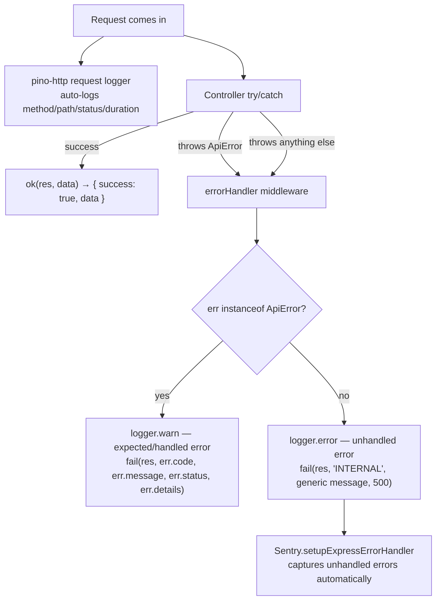

# Logging, Observability & Error Handling

## The layers



## Structured logging — Pino

`backend/src/utils/logger.ts` is the single logger instance imported everywhere (never
`console.log` directly in application code). Configuration:

- `level` from `LOG_LEVEL` env var, default `info`.
- **Pretty-printed, colorized** output in non-production (`pino-pretty` transport) — readable in
  a local terminal; **raw JSON** in production — ingestible by log aggregators (Render's log
  viewer, or anything downstream).
- **Redaction**: `req.headers.authorization`, `*.phone`, `*.address`, `req.headers.cookie`,
  `res.headers["set-cookie"]` are stripped from any logged object matching those paths. See
  [`09-security.md`](./09-security.md#pii-handling) for what this does and doesn't cover.
- `request.logger.middleware.ts` wraps the whole app with `pino-http`, which auto-generates a
  structured log line per request (method, path, status code, response time, a generated request
  id) using this same logger instance — so request-level and application-level logs share one
  consistent format and destination.

Application code logs generously at each meaningful step, especially in the agent turn lifecycle
(`runTurn.ts` logs the start of each attempt, its outcome, retry decisions, and final
success/failure — with `sessionId`, `attempt`, `provider`, `model`, and `elapsedMs` as structured
fields throughout) and every queue/worker action (webhook processing, cleanup sweep decisions).
This makes tracing "what happened to order X" or "why did turn Y fail" from logs alone realistic
without needing to reproduce the request. `runTurn.ts` also logs the raw agent output and its
validated form on each turn, which is useful during active development for inspecting exactly
what the model produced end to end.

## The `ApiError` / `ApiResponse` contract

Every API response — success or failure — follows one shape, enforced by two small utility
modules:

```ts
// Success
{ success: true, data: T }

// Failure
{ success: false, error: { code: ErrorCode, message: string, details?: unknown } }
```

`ApiError extends Error` carries a `code` (`BAD_REQUEST | UNAUTHORIZED | NOT_FOUND | CONFLICT |
RATE_LIMITED | INTERNAL`) that maps deterministically to an HTTP status
(400/401/404/409/429/500) via a lookup table — controllers throw a semantic `ApiError` and never
have to think about status codes directly. Every controller follows the same
`try { ... } catch (err) { next(err); }` pattern, so **all** error handling funnels through the
single `errorHandler` middleware.

`errorHandler.middleware.ts`:
- `ApiError` instances → `logger.warn` (expected, handled cases — bad input, conflicts, etc. —
  not incidents) → the error's own code/message/status/details are sent to the client verbatim.
- Anything else (a genuine bug, an unexpected DB error, etc.) → `logger.error` with the full
  error object, and the **client only ever sees** a generic `{ code: 'INTERNAL', message:
  "Something went wrong. We are on it." }` with a `500` — internal error details are never leaked
  to the frontend.

The frontend's `lib/api.js` mirrors this exact contract on the way back in — it throws a
matching `ApiError` class (same shape: `code`, `message`, `status`, `details`) whenever
`payload.success` is falsy, so error handling is consistent end-to-end.

## Sentry

- `backend/src/instrument.ts` initializes the Node Sentry SDK (`dsn: SENTRY_DSN`,
  `environment: NODE_ENV`, `tracesSampleRate: 1.0` — 100% trace sampling) and is imported as the
  **very first line** of `index.ts`, before anything else — required by Sentry's Node
  instrumentation to properly auto-instrument subsequent imports.
- `Sentry.setupExpressErrorHandler(app)` is wired in **after** all routes but **before** the
  custom `errorHandler` — so Sentry sees every error that reaches Express's error-handling chain
  before the custom handler formats the client-facing response.
- If `SENTRY_DSN` is unset, the SDK initializes as a no-op client — safe to omit locally.
- `tracesSampleRate: 1.0` means literally every transaction is sampled for performance tracing —
  fine at demo/low traffic, would need tuning down before any real production load to control
  Sentry event volume/cost.
- The frontend has its own lightweight error surface: `ErrorBoundary.jsx` (a class component)
  catches render-time React errors and logs them via `frontend/src/lib/logger.js` — a minimal
  console-based logger, **not** connected to Sentry or any external service on the frontend side.
  There's no frontend Sentry SDK in this codebase — frontend runtime errors outside the boundary
  (e.g. an unhandled promise rejection) aren't captured anywhere beyond the browser console.

## Health check

```
GET /health
```

Runs `SELECT 1` against Postgres and returns `{ status: 'ok', db: 'connected' }` (200) or
`{ status: 'error', db: 'unreachable' }` (503) — a lightweight liveness check suitable for
uptime monitors and the hosting platform's own health probes.

## The `AuditLog` table as a *product-facing* observability feature

Separately from developer-facing logs/Sentry, Convocart also has a purpose-built,
customer/admin-visible observability feature: the `AuditLog` table (see
[`02-database-schema.md`](./02-database-schema.md)), rendered as a human-readable timeline via
`AuditTrail.jsx` on both the public order-tracking page and the admin order-detail page. It's
worth mentioning here because it plays the same "what actually happened and why" role that logs
play for engineers — just aimed at end users and support staff instead.

## Frontend dev-only console logging

`frontend/src/lib/devLogger.js`, combined with `frontend/vite-terminal-logger.js` (a small custom
Vite plugin), pipes structured, color-coded API request/response/error logs from the **browser
console straight into the terminal running `npm run dev`** — genuinely useful local-dev tooling,
automatically inert (`import.meta.env.DEV` gated) in a production build, so none of this ships to
real users. See [`11-frontend-architecture.md`](./11-frontend-architecture.md) for detail.
