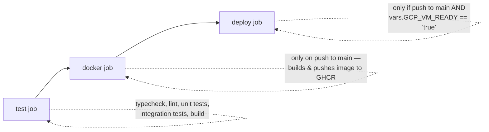

# CI/CD & Deployment

## Live environments

| Component | Host | URL |
|---|---|---|
| Frontend (static Vite build) | Vercel | `https://convocart-oqc5.vercel.app/` |
| Backend (Express API + BullMQ workers, one process) | Render | `https://convocart-backend.onrender.com` (`GET /health` for a liveness check) |

Both platforms deploy directly from the GitHub repository via their own native
GitHub-integration (push-to-deploy), **independent of** the GitHub Actions workflow described
below. Neither Vercel's nor Render's own build configuration is checked into this repo (no
`render.yaml`, no `vercel.json` build overrides beyond the SPA rewrite rule) — they're configured
through each platform's dashboard.

## GitHub Actions (`.github/workflows/ci.yml`)

Triggers: `push` to `main`, and every `pull_request` targeting `main`.



### `test` job (runs on every push and PR)

Runs entirely inside `backend/`, on `ubuntu-latest`, Node 24:

1. `npm ci`
2. `npx prisma generate`
3. `npm run typecheck` (`tsc --noEmit`)
4. `npm run lint` (ESLint)
5. `npm test` (Vitest unit tests, `NODE_ENV=test`, `GEMINI_API_KEY=test-key` — see
   [`14-testing.md`](./14-testing.md) for why env validation is bypassed in tests)
6. `npm run test:integration` — spins up **real, ephemeral Postgres and Redis containers via
   Testcontainers** (`@testcontainers/postgresql`, `@testcontainers/redis`) directly inside the
   GitHub-hosted runner (which has Docker available out of the box) — not mocks. See
   [`14-testing.md`](./14-testing.md).
7. `npm run build` (`tsc` — compiles to `dist/`)

This job covers `backend/` end to end — type safety, linting, both test tiers, and a production
build — before anything reaches `main`.

### `docker` job (only on push to `main`, after `test` passes)

Builds the backend's `Dockerfile` (multi-stage: `npm ci` → `prisma generate` → `tsc` build in a
`builder` stage; a slim `runtime` stage with only production deps + compiled `dist/` +
`node_modules/.prisma` + `openssl`, since Prisma's engine needs it) and pushes
`ghcr.io/<owner>/convocart-backend:latest` to the GitHub Container Registry, authenticated with
the automatic `GITHUB_TOKEN`.

The container's `CMD` runs `npx prisma migrate deploy && node dist/index.js` — migrations are
applied automatically on every container start, before the server boots.

### `deploy` job (conditionally gated)

```yaml
if: github.ref == 'refs/heads/main' && vars.GCP_VM_READY == 'true'
```

SSHes into a GCP VM (`GCP_VM_HOST`/`GCP_VM_USER`/`GCP_VM_SSH_KEY` secrets) and does a manual
`docker pull` + `stop` + `rm` + `run` of the freshly-pushed image, passing an `.env` file that's
expected to already exist on the VM. This gives the project a self-hosted deployment option
alongside the managed Render/Vercel setup — it activates only when the repository variable
`GCP_VM_READY` is explicitly set to `"true"`, so it stays inert unless and until that target is
actually provisioned.

### Secrets/vars this workflow depends on

| Name | Kind | Used by |
|---|---|---|
| `GITHUB_TOKEN` | automatic | `docker` job, GHCR auth |
| `GCP_VM_HOST`, `GCP_VM_USER`, `GCP_VM_SSH_KEY` | repo secrets | `deploy` job |
| `GCP_VM_READY` | repo **variable** (not secret) | gates whether `deploy` runs at all |

## Docker image (backend only — no frontend Dockerfile)

`backend/Dockerfile`:

```dockerfile
FROM node:24-slim AS builder
WORKDIR /app
COPY package*.json ./
RUN npm ci
COPY . .
RUN npx prisma generate
RUN npm run build

FROM node:24-slim AS runtime
WORKDIR /app
RUN apt-get update -y && apt-get install -y openssl && rm -rf /var/lib/apt/lists/*
ENV NODE_ENV=production
COPY package*.json ./
RUN npm ci --omit=dev --ignore-scripts
COPY --from=builder /app/dist ./dist
COPY --from=builder /app/prisma ./prisma
COPY --from=builder /app/node_modules/.prisma ./node_modules/.prisma
EXPOSE 4000
CMD ["sh", "-c", "npx prisma migrate deploy && node dist/index.js"]
```

Standard, sensible multi-stage build: dev dependencies and TypeScript source never make it into
the runtime image; the Prisma generated client and `openssl` (a real runtime requirement for
Prisma's query engine on Debian slim images) are explicitly carried over.

## What deploys the live app today

- **Frontend**: push to `main` → Vercel's own GitHub integration builds (`vite build`) and
  deploys `frontend/`.
- **Backend**: push to `main` → Render's own GitHub integration builds and deploys `backend/`.
- **GitHub Actions**: runs the full backend quality gate (typecheck, lint, unit + integration
  tests, build) on every push/PR, and additionally produces a versioned GHCR image for the
  self-hosted deployment path described above.

See the root [`README.md`](../README.md) for how to reproduce all of this locally without any of
the cloud pieces.
